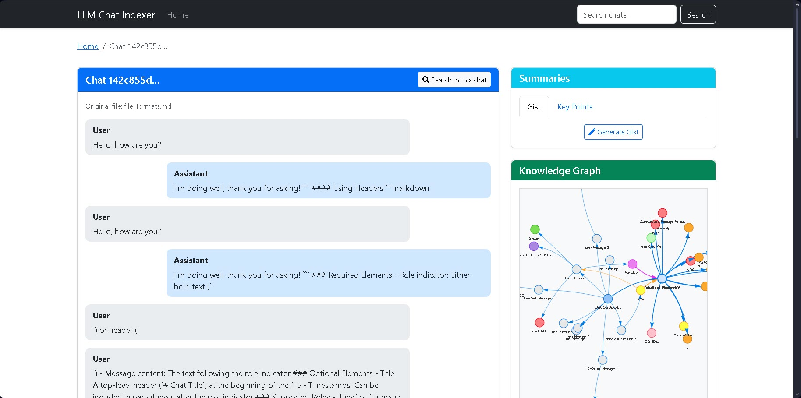

# LLM Chat Indexer

Heavy Usage of AI was made to try to build this.  

---



A web application for indexing, searching, and analyzing chat conversations with large language models (LLMs).

## Features

- **Chat Indexing**: Upload and index chat logs in JSON or Markdown format
- **Semantic Search**: Search across your chat history using natural language queries
- **Knowledge Graph Generation**: Automatically extract entities and relationships from chats
- **Chat Summarization**: Generate concise summaries of chat conversations
- **Web Interface**: User-friendly web interface for all functionality

## Table of Contents

- [Installation](#installation)
  - [Prerequisites](#prerequisites)
  - [Setup](#setup)
  - [Environment Variables](#environment-variables)
- [Usage](#usage)
  - [Starting the Application](#starting-the-application)
  - [Uploading Chats](#uploading-chats)
  - [Searching Chats](#searching-chats)
  - [Generating Summaries](#generating-summaries)
  - [Exploring Knowledge Graphs](#exploring-knowledge-graphs)
- [API Reference](#api-reference)
- [Development](#development)
  - [Running Tests](#running-tests)
  - [Project Structure](#project-structure)
- [License](#license)

## Installation

### Prerequisites

- Python 3.8 or higher
- pip (Python package installer)
- ChromaDB (for vector storage)
- Google Gemini API key (for summarization and entity extraction)

### Setup

1. Clone the repository:

```bash
git clone https://github.com/yourusername/llm-chat-indexer.git
cd llm-chat-indexer
```

2. Create and activate a virtual environment:

```bash
# On Windows
python -m venv venv
venv\Scripts\activate

# On macOS/Linux
python -m venv venv
source venv/bin/activate
```

3. Install the required packages:

```bash
pip install -r requirements.txt
```

4. Create a `.env` file based on the provided `.env.example`:

```bash
cp .env.example .env
```

5. Edit the `.env` file and add your API keys and configuration settings.

6. Validate your configuration:

```bash
python scripts/validate_config.py
```

### Environment Variables

The following environment variables can be set in the `.env` file:

| Variable | Description | Default |
|----------|-------------|---------|
| `VECTOR_STORE_PATH` | Path to store vector embeddings | `./data/vector_store` |
| `KG_PATH` | Path to store knowledge graphs | `./data/knowledge_graphs` |
| `GEMINI_API_KEY` | Google Gemini API key | None (required for summarization) |
| `SENTENCE_TRANSFORMER_MODEL` | Model for generating embeddings | `all-MiniLM-L6-v2` |
| `CHUNK_SIZE` | Size of text chunks for embedding | `1000` |
| `CHUNK_OVERLAP` | Overlap between consecutive chunks | `200` |
| `TOP_K_RESULTS` | Number of results to return in search | `5` |
| `CHROMA_SERVER_HOST` | Host for ChromaDB server | `localhost` |
| `CHROMA_SERVER_HTTP_PORT` | Port for ChromaDB server | `8000` |
| `ALLOW_RESET` | Whether to allow resetting the database | `True` |

## Usage

### Starting the Application

#### Option 1: All-in-One Startup Script (Recommended)

Use the unified startup script that checks dependencies, starts ChromaDB, and runs the Flask application:

```bash
python start_app.py
```

#### Option 2: Manual Startup

1. Check and install dependencies:

```bash
python scripts/check_dependencies.py
```

2. Start the ChromaDB server (optional, for better performance):

```bash
python scripts/start_chroma.py
# or
python run_chroma_server.py
```

3. Run the web application:

```bash
python run.py
```

4. Open your browser and navigate to `http://localhost:5000`

### Uploading Chats

1. From the home page, click the "Upload Chat" button
2. Select a JSON or Markdown file containing your chat conversation
3. Click "Upload" to process and index the chat
4. The application will automatically extract entities and build a knowledge graph

#### Supported File Formats

- **JSON**: A JSON file with a `messages` array containing objects with `role` and `content` fields
- **Markdown**: A Markdown file with messages formatted as `**User**:` and `**Assistant**:` headers

Example JSON format:
```json
{
  "messages": [
    {
      "role": "user",
      "content": "Hello, how are you?",
      "timestamp": "2023-01-01T12:00:00Z"
    },
    {
      "role": "assistant",
      "content": "I'm doing well, thank you for asking!",
      "timestamp": "2023-01-01T12:00:05Z"
    }
  ]
}
```

Example Markdown format:
```markdown
# Chat Session

**User**: Hello, how are you?

**Assistant**: I'm doing well, thank you for asking!
```

### Searching Chats

1. Use the search bar at the top of any page to search across all indexed chats
2. Enter a natural language query and press Enter
3. View the search results, which will show matching messages from your chats
4. Click on a result to view the full context of the conversation

### Generating Summaries

1. Navigate to a specific chat by clicking on its ID from the home page
2. Click the "Generate Summary" button
3. Choose the summary type (gist or key points)
4. View the generated summary of the conversation

### Exploring Knowledge Graphs

1. Navigate to a specific chat by clicking on its ID from the home page
2. Click the "View Knowledge Graph" button
3. Explore the interactive visualization of entities and relationships
4. Hover over nodes to see entity details and connections

## API Reference

The application provides a REST API for programmatic access to its functionality.

### Endpoints

#### GET /api/graph/{chat_id}

Returns the knowledge graph for a specific chat.

Query Parameters:
- `format` (optional): The format of the graph data (`json` or `cytoscape`). Default: `json`

Example:
```bash
curl http://localhost:5000/api/graph/24f0b044-aae3-47e3-a294-afbad939cd24?format=json
```

#### GET /summary/{chat_id}

Generates a summary for a specific chat.

Query Parameters:
- `type` (optional): The type of summary to generate (`gist` or `key_points`). Default: `gist`

Example:
```bash
curl http://localhost:5000/summary/24f0b044-aae3-47e3-a294-afbad939cd24?type=key_points
```

#### GET /search

Searches across indexed chats.

Query Parameters:
- `query` (required): The search query
- `chat_id` (optional): Limit search to a specific chat

Example:
```bash
curl http://localhost:5000/search?query=renewable+energy
```

## Documentation

Detailed documentation is available in the following files:

- [User Guide](docs/user_guide.md): Instructions for using the application
- [Developer Guide](docs/developer_guide.md): Information for developers
- [File Format Specification](docs/file_formats.md): Details about supported file formats
- [API Documentation](API.md): Reference for the REST API
- [Setup Guide](SETUP.md): Instructions for setting up the application

API documentation is also available through the Swagger UI at `/api/docs` when the application is running.

## Development

### Running Tests

Run all tests:

```bash
python run_tests.py
```

Run specific test modules:

```bash
python run_tests.py --module test_parsing
```

Run with coverage report:

```bash
python run_tests.py --coverage
```

### Project Structure

```text
llm-chat-indexer/
├── config/                 # Configuration settings
│   ├── settings.py         # Application settings
│   └── config.py           # Configuration management
├── data/                   # Data storage
│   ├── knowledge_graphs/   # Stored knowledge graphs
│   ├── raw_chats/          # Uploaded chat files
│   └── vector_store/       # Vector embeddings
├── scripts/                # Utility scripts
│   ├── check_dependencies.py # Script to check and install dependencies
│   ├── start_chroma.py     # Script to start ChromaDB server
│   └── validate_config.py  # Configuration validation
├── src/                    # Source code
│   ├── api/                # API documentation and endpoints
│   ├── indexing/           # Chat indexing functionality
│   ├── knowledge_graph/    # Knowledge graph generation
│   ├── llm_clients/        # LLM API clients
│   ├── parsing/            # Chat file parsing
│   ├── search/             # Semantic search functionality
│   ├── summarization/      # Chat summarization
│   └── utils/              # Utility functions
├── static/                 # Static web assets
│   └── css/                # CSS stylesheets
├── templates/              # HTML templates
├── tests/                  # Test suite
├── .env.example            # Example environment variables
├── requirements.txt        # Python dependencies
├── requirements-dev.txt    # Development dependencies
├── run.py                  # Main application entry point
├── run_chroma_server.py    # Script to run ChromaDB server
├── run_tests.py            # Test runner
└── start_app.py            # Unified startup script
```

## License

This project is licensed under the MIT License - see the LICENSE file for details.
